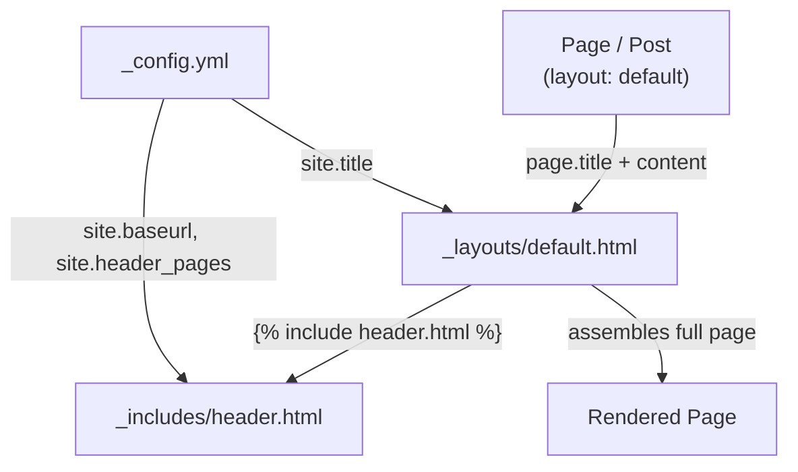

```mermaid
flowchart TD
    CONFIG["_config.yml"]
    PAGE["Page / Post\n(layout: default)"]
    DEFAULT["_layouts/default.html"]
    HEADER["_includes/header.html"]
    OUTPUT["Rendered Page"]

    CONFIG -->|"site.title"| DEFAULT
    CONFIG -->|"site.baseurl, site.header_pages"| HEADER
    PAGE -->|"page.title + content"| DEFAULT
    DEFAULT -->|"{% include header.html %}"| HEADER
    DEFAULT -->|"assembles full page"| OUTPUT

```